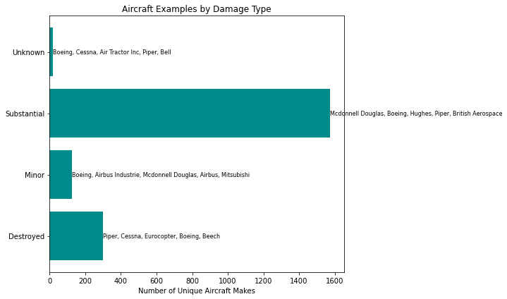

# Aviation Data Analysis (NTSB)

## Overview
Our company is planning to diversify into the aviation business and plans to purchase and operate aircrafts for both commercial and private enterprises. Since the industry carries a lot of safety, financial and operational risks, the leadership wants to identify which aircraft models have the lowest risk investment while balancing safety, reliability and cost-effectiveness. 

This project therefore analyzes **aviation safety data** using Pandas, Matplotlib.pyplot and Seaborn.

It explores aircraft makes, engine types, injury severity, and mechanical reliability to support **data-driven recommendations** for the most operational, safe and mechanically realiable aircraft for procurement.

---

## Business Understanding

Key business Question - Our company is interested in purchasing and operating airplanes for commercial and private enterprises, but do not know anything about the potential risks of aircraft. We are charged with determining which aircraft are the lowest risk for the company.

To determine:

1. Different aircraft make and models and categorize based on aircraft category and purpose of flight.

Within each category, to determine the relation between Airplane Make and:

2.  Operational cost effectiveness (Engine type).

3. Safety risk (injury severity, total fatal injuries, total serious injuries). 

4. Mechanical reliability and environmental susceptibility of the aircraft (aircraft damage).

## Data Understanding and Analysis

### Data Source
The data we will be using was sourced from the National Transportation Safety Board, `aviation_data.csv`.

### Data Description
The data includes aviation accident data from 1962 to 2023 about civil aviation accidents and selected incidents in the United States and international waters.

In the original dataset, we had a total of 31 columns, of which 12 were selected for analysis as shown below:

| Column | Description |
----------------------------------------------------------------------------------------------------------- |
| `Event.Date`             | **Date of Event (Accident or Incident)** — The date when the aviation accident or incident occurred.        |
| `Total.Fatal.Injuries`   | **Total Number of Fatal Injuries** — Number of people who lost their lives as a result of the accident.     |
| `Total.Serious.Injuries` | **Total Number of Serious Injuries** — Number of people seriously injured (requiring hospitalization).      |
| `Total.Minor.Injuries`   | **Total Number of Minor Injuries** — Number of people with minor, non-serious injuries.                     |
| `Injury.Severity`        | **Severity Classification of Injuries** — Overall category summarizing injury impact in the accident: Categorized into 'Non-Fatal', 'Fatal', 'Minor', 'Serious', 'Incident'.
| `Aircraft.damage`        | **Extent of Aircraft Damage** — The level of structural damage sustained by the aircraft: Categorized into: 'Substantial', 'Destroyed', 'Minor', 'Unknown'.                 |
| `Make`                   | **Aircraft Manufacturer** — Company or organization that produced the aircraft: Categorized into: 'Cessna', 'Piper', 'Boeing', 'Beech', 'Bell', 'Airbus', 'Robinson',
       'Air Tractor Inc', 'Robinson Helicopter', 'Robinson Helicopter Company',
       ...
       'Porbeck John M', 'Douglas Brian G', 'Nelson', 'Zenair Ltd',
       'Angus Watt', 'Bowman', 'Grumman Aircraft', 'Yuneec',
       'Krusmark David Homer', 'Welch Floyd L'                           |
| `Model`                  | **Aircraft Model** — Specific model or version of the aircraft produced by the manufacturer.                |
| `Engine.Type`            | **Engine Type** — Classification of the engine propulsion system used in the aircraft: Categorized into: 'Reciprocating', 'Turbo Prop', 'Turbo Shaft', 'Turbo Fan', 'Turbo Jet',
       'Unknown', 'Geared Turbofan', 'None', 'Electric', 'LR', 'NONE',
       'Hybrid Rocket', 'UNK'                     |
| `Aircraft.Category`      | **Category of Aircraft** — General class of aircraft based on design and intended use: Categorized into: 'Airplane', 'Helicopter', 'Glider', 'Balloon', 'Weight-Shift',
       'Powered Parachute', 'Gyrocraft', 'Ultralight', 'WSFT', 'Unknown',
       'Rocket', 'Blimp', 'UNK'                      |
| `Purpose.of.flight`      | **Purpose of Flight** — Describes the operational intent or mission of the flight: Categorized into: 'Personal', 'Instructional', 'Aerial Application', 'Business',
       'Positioning', 'Other Work Use', 'Aerial Observation', 'Flight Test',
       'External Load', 'Executive/corporate', 'Skydiving',
       'Public Aircraft - Federal', 'Ferry', 'Banner Tow',
       'Public Aircraft - Local', 'Public Aircraft - State', 'Air Race show',
       'Public Aircraft', 'Glider Tow', 'Firefighting', 'Air Drop', 'PUBS',
       'ASHO', 'PUBL'                          |
| `Air.carrier`            | **Air Carrier / Operator Name** — The airline, charter company, or organization responsible for the flight. |

---

### Data Visualizations:

#### Dashboard Links
The link to our interactive dashboard is: https://public.tableau.com/app/profile/thomas.amuti/viz/SummaryDashboardontheTopMostOperationalSafeandMechanicallyStableAirCraftMakes/SummaryDashboardontheTopMostOperationalSafeandMechanicallyStableAirCraftMakes?publish=yes

The dashboard summarizes the top Aircraft Makes that are:

1. Most operational based on engine type.

2. Safest based on having the least total fatal injuries.

3. Mechanically stable based on having a non-fatal injury severity.

## Conclusion
In this notebook, we were able to suggest the most operational, safe and mechanically reliable plane for procurement for our company using data from the NTSB report of accidents from 1962 - 2023. From our dataset, it appears that the safest plane (one with the least number of accidents) were purposefully used for personal flights. These had the least number of fatal injuries, serious injuries while having a non-fatal injury severity and minor aircraft accidents. In addition to the above, if the company wishes to procure a plane:

1. For long range flights, the 'GulfStream American Corp'. is the best.

2. For medium range flights, the 'Evo13 Llc', 'Short Brothers' & 'Harland Ltd' are the best options.

3. For short range flights, the 'T Bird', 'Rolladen-Schneider Ohg', 'Univar', 'Krusmark David Homer', 'Starduster Ii', 'Mueller Michael Walter', 'Schleicher Alexander', 'Boeing 777-306Er', 'Consolidated Vultee', 'Dji', 'Honda' are the best options.

Suggestion for further studies: Despite having analyzed this dataset to suggest which aircrafts Makes had the least air crashes while still being most operational, safe and mechanically sound, the best suggestions would have been derived from a dataset of commonly used aircrafts instead.
